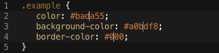
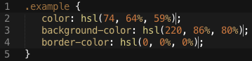

# About

A plugin based on Tony Adams one, [Hex-To-HSL](https://github.com/atadams/Hex-to-HSL-Color). Intended to allow translation between different color formats; RGB, HEX, HSL, RGBA.

Under development. Still only convert between HEX to HSL.

# Installation
I do not advice trying this plugin yet... but if you must, checkout this plugin into your Sublime Packages directory. This can usually be found under Sublime->Preferences->Browse Packages.

# Usage
Put the cursor on or select one or more hex colors (three character colors are OK)

The colors will be converted to a properly formated CSS HSL color.

